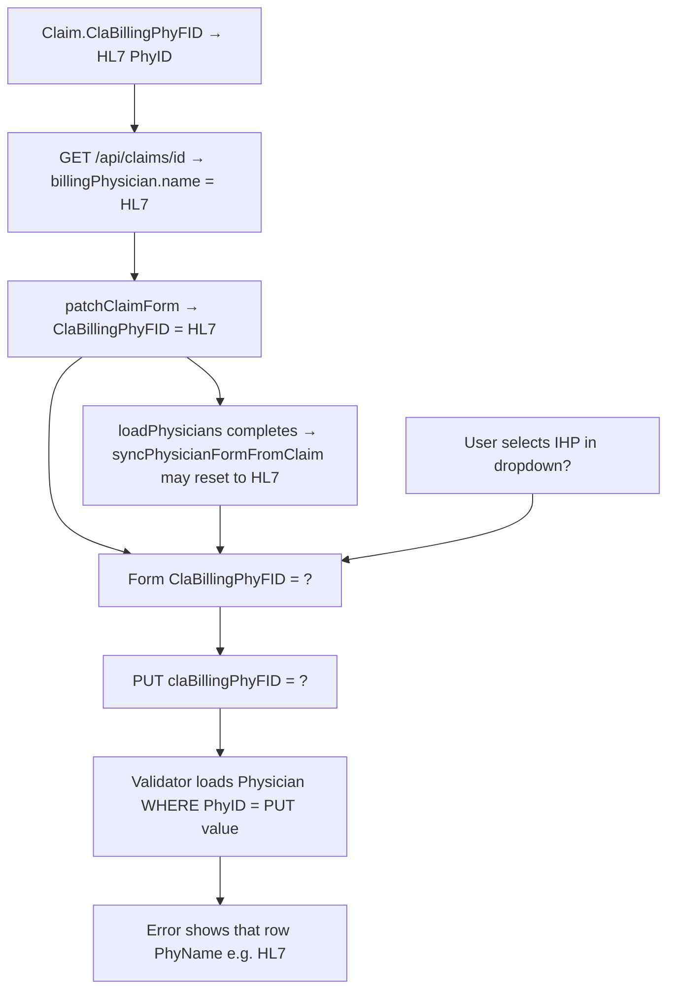

# Investigation: Claim save validates "HL7" while UI shows "IHP MI EMERGENCY MEDICINE PLLC"

**Status:** Investigation only — no implementation changes in this pass.  
**Goal:** Identify where provider name `HL7` enters the save/validation pipeline vs what the Billing Provider dropdown displays.

---

## Executive summary

Backend validation **does not** pick a provider by label, facility default, or cached claim entity. It loads the `Physician` row for **`request.ClaBillingPhyFID` only**.

Therefore, if the error message says `Billing provider "HL7,"` (or similar), the **PhyID in the PUT body** resolves to the HL7 physician row in the database — not IHP.

The most likely explanations (ranked):

| # | Hypothesis | Layer |
|---|------------|--------|
| 1 | **PUT still sends HL7 PhyID** while user believes billing is IHP (stale FK / form not updated) | Frontend payload or DB |
| 2 | **User is viewing Service Facility (IHP)** but Billing dropdown / FK is still HL7 | UI field confusion |
| 3 | **`syncPhysicianFormFromClaim()` overwrites** billing selection when `loadPhysicians()` completes after user picked IHP | Frontend race |
| 4 | **Historical payload fallback** (`partial.claBillingPhyFID ?? claim.billingPhysician?.phyID`) if running an older frontend bundle | Frontend (legacy) |
| 5 | HL7 row fails validation with **PhyPrimaryCodeType = RE** (wrong role on billing slot) | DB + validator (correct rejection) |

**Not supported by code review:**

- Backend replacing billing FK with facility default on claim `PUT`
- Validator reading `preImage.ClaBillingPhyFID` instead of request
- Validator using Service Facility PhyID for billing checks

---

## 1. End-to-end pipeline (current code)

### A. Claim load / hydration

| Step | Location | What happens |
|------|----------|--------------|
| GET claim | `ClaimsController.GetClaimById` ~2235 | Response includes `BillingPhysician`, `FacilityPhysician`, `RenderingPhysician` from EF joins. **Does not include top-level `ClaBillingPhyFID` / `ClaFacilityPhyFID` in JSON.** |
| Normalize | `claim-api.service.ts` → `normalizeClaimDetail()` | Sets `claBillingPhyFID` from `claBillingPhyFID`/`ClaBillingPhyFID` **or** `billingPhysician.phyID`. |
| Patch form | `claim-details.component.ts` → `patchClaimForm()` | `ClaBillingPhyFID: getClaimBillingPhyFid()` → `claim.claBillingPhyFID ?? claim.billingPhysician?.phyID`. |
| Load physicians | `loadPhysicians()` (parallel in `ngOnInit`) | Builds `billingProviders` = Non-Person + billing classification + **not** `isSystemPlaceholder`. |
| **Re-patch** | `syncPhysicianFormFromClaim()` at end of `loadPhysicians()` | **Overwrites** `ClaBillingPhyFID` / rendering / facility from **stored claim FKs again**. |

**Implication:** Claim row `ClaBillingPhyFID` in DB (often HL7 from import) drives initial form state. Any user change to IHP **before** `loadPhysicians()` completes can be **reset to HL7** when `syncPhysicianFormFromClaim()` runs.

### B. Dropdown binding

| Control | FormControl | Options source | compareWith |
|---------|-------------|----------------|-------------|
| Billing Provider | `ClaBillingPhyFID` | `billingProviders` (+ HL7 injected via `ensureCurrentPhysiciansInOptions` if claim FK = HL7) | `comparePhyFid` |
| Service Facility | `ClaFacilityPhyFID` | `serviceFacilities` (all Non-Person) | `comparePhyFid` |
| Rendering Provider | `ClaRenderingPhyFID` | `renderingProviders` (Person) | `comparePhyFid` |

Display hint (if present in build): `Selected: {{ getSelectedBillingProviderLabel() }} (PhyID …)` — label and PhyID both come from **`getFormPhyFid('ClaBillingPhyFID')`**, same source.

**If hint shows IHP name + IHP PhyID, form FK is IHP.**  
**If hint shows HL7 name + HL7 PhyID, form FK is still HL7** (even if IHP appears elsewhere on screen).

### C. Save path

```
saveAndClose() / save()
  → validateBillToSelection()
  → validateBillingProviderForSave()
       refreshBillingProviderValidation()
       uses getFormPhyFid('ClaBillingPhyFID') → lookup in physicians / billingProviders
  → claBillingPhyFID = getFormPhyFid('ClaBillingPhyFID')
  → buildClaimUpdatePayload({ claBillingPhyFID, ... })
       CURRENT: claBillingPhyFID: partial.claBillingPhyFID  (no claim.billingPhysician fallback)
  → logClaimSaveProviderTrace() → console.debug
  → claimApiService.updateClaim() → PUT body
```

### D. API client

`claim-api.service.ts` `updateClaim()`:

- Includes `claBillingPhyFID` in JSON when `body.claBillingPhyFID !== undefined` (including `0`).

### E. Backend update + validation

`ClaimsController.UpdateClaim` (~2461+):

1. Loads tracked `claim` entity (DB row).
2. `preImage.ClaBillingPhyFID` = **stored** FK before mutation (logged).
3. If `request.ClaBillingPhyFID.HasValue`:
   - `billingPhyId = request.ClaBillingPhyFID.Value`
   - Query `Physician` WHERE `PhyID == billingPhyId` AND tenant/facility match
   - `billingLabel = billingRow.PhyFullNameCC ?? billingRow.PhyName` → **this is the name in the error**
   - `BillingProviderOperationalRules.GetOperationalBillingProviderFailures(...)`
   - On success: `claim.ClaBillingPhyFID = billingPhyId`

**Validator provider source:** exclusively `request.ClaBillingPhyFID` → DB `Physician` row.  
**Not** facility default, not `ClaFacilityPhyFID`, not `preImage` (except for logging).

Patient save can sync `Claim.ClaBillingPhyFID` from patient billing (`PatientsController.SyncClaimBillingProviderFromPatientAsync`) — **only on patient save**, not during claim `PUT`.

---

## 2. Where "HL7" enters the flow



| Entry point | Mechanism |
|-------------|-----------|
| **Database** | HL7 import / placeholder assigns `Claim.ClaBillingPhyFID` to HL7 physician row. Until a successful save, row stays HL7. |
| **GET hydration** | `BillingPhysician` join reflects that FK. |
| **ensureCurrentPhysiciansInOptions** | If claim FK is HL7 but HL7 excluded from filtered `billingProviders`, HL7 is **still added** to dropdown so user sees legacy billing assignment. |
| **syncPhysicianFormFromClaim** | Re-applies stored claim FK after physician list loads — can undo IHP selection if timing is wrong. |
| **Legacy payload builder** (if old bundle deployed) | `claBillingPhyFID: partial ?? claim.billingPhysician?.phyID` sends HL7 when form value is `null`/`undefined`. |
| **Field confusion** | IHP as **Service Facility** (`ClaFacilityPhyFID`); billing remains HL7 — user reads wrong dropdown. |

---

## 3. Validator behavior (RE vs BI)

**Class:** `BillingProviderOperationalRules`  
**Called from:** `ClaimsController.UpdateClaim` when `request.ClaBillingPhyFID` is present.

| Rule | Field | Pass when |
|------|-------|-----------|
| Not placeholder | `IsSystemPlaceholder` | false |
| Entity type | `PhyType` | `Non-Person` |
| Classification | `PhyPrimaryCodeType` | blank **or** resolves to `BI` (via `PhysicianTaxonomy.TryResolveClassification` / `NormalizeStoredClassification`) |
| Address | `PhyAddress1`, `PhyCity`, `PhyState`, `PhyZip` | all non-empty |
| NPI | `PhyNPI` | non-empty |
| Tax ID | `PhyPrimaryIDCode` | non-empty |

**Error text generation:**

- Summary: `ClaimsController` ~2540–2569 → `billingLabel` from **validated row**
- Detail lines include `PhyPrimaryCodeType (stored)` and `ResolvedClassification`
- Failure line example: `PhyPrimaryCodeType = RE (resolved: RE) (expected BI or label "Billing")`

If user sees **RE**: the physician row tied to **PUT billing PhyID** has `PhyPrimaryCodeType = 'RE'` (rendering), not IHP billing org with `BI`.

HL7 legacy rows may be `RE`, `null`, or `Bi`/`Billing` depending on import/migration — must be confirmed per PhyID in DB.

**IHP row expectation (if truly billing):** `PhyType = Non-Person`, `PhyPrimaryCodeType = BI` (or `Billing`), address/NPI/tax populated.

---

## 4. Provider IDs to capture at runtime (no fixes — use existing logs)

### Frontend (already present in current tree)

On save, DevTools console should show:

```text
[ClaimDetails] provider save trace {
  action: 'saveAndClose' | 'save',
  formBillingPhyFID: <number>,
  formBillingLabel: '<name from form FK>',
  claimStoredBillingPhyFID: <number from loaded claim>,
  claimStoredBillingName: '<billingPhysician.phyName from load>',
  payloadClaBillingPhyFID: <number in PUT>,
  payloadClaFacilityPhyFID: <number>,
  payloadClaRenderingPhyFID: <number>
}
```

**Interpretation:**

| Check | If HL7 bug | If correct |
|-------|------------|------------|
| `formBillingLabel` | `HL7` or `HL7,` | `IHP MI EMERGENCY MEDICINE PLLC` |
| `formBillingPhyFID` | HL7 PhyID | IHP PhyID |
| `payloadClaBillingPhyFID` | must equal HL7 PhyID | must equal IHP PhyID |
| `claimStoredBillingPhyFID` | HL7 PhyID until save succeeds | HL7 until save succeeds |

Also compare **Billing** hint PhyID vs **Service Facility** dropdown selection.

### Network

`PUT /api/claims/{claId}` body:

```json
"claBillingPhyFID": <must match intended billing org>,
"claFacilityPhyFID": <often IHP if that org is facility>,
"claRenderingPhyFID": ...
```

### Backend (already present in current tree)

1. `Claim {ClaId} save provider IDs: stored Billing=…, request Billing=…, stored Facility=…, request Facility=…`
2. `billing provider validation snapshot: PhyID=…, PhyPrimaryCodeType=…, ResolvedClassification=…`
3. Warning with full `Details` including provider name

**If `request Billing` ≠ IHP PhyID while UI shows IHP → frontend/payload issue.**  
**If `request Billing` = IHP PhyID but error name is HL7 → impossible unless IDs collide (verify DB).**

### SQL (authoritative)

```sql
-- Replace @ClaId, @TenantId, @FacilityId
SELECT c.ClaID, c.ClaBillingPhyFID, c.ClaFacilityPhyFID, c.ClaRenderingPhyFID
FROM Claim c
WHERE c.ClaID = @ClaId;

SELECT p.PhyID, p.PhyName, p.PhyFullNameCC, p.PhyType, p.PhyPrimaryCodeType,
       p.PhyAddress1, p.PhyCity, p.PhyState, p.PhyZip, p.PhyNPI, p.PhyPrimaryIDCode,
       p.IsSystemPlaceholder, p.PhyInactive, p.FacilityId
FROM Physician p
WHERE p.PhyName LIKE '%HL7%'
   OR p.PhyFullNameCC LIKE '%HL7%'
   OR p.PhyName LIKE '%IHP%'
   OR p.PhyFullNameCC LIKE '%EMERGENCY MEDICINE%'
ORDER BY p.PhyID;

-- Facility default (not used on claim PUT, but context)
SELECT FacilityId, DefaultBillingProviderId FROM FacilityScopes WHERE FacilityId = @FacilityId;
```

Compare **two PhyIDs** and full column sets for HL7 vs IHP rows.

---

## 5. Frontend vs backend vs DB vs validation — verdict matrix

| Symptom | Most likely layer |
|---------|-------------------|
| PUT `claBillingPhyFID` = HL7 PhyID, UI billing hint shows HL7 | DB + form correctly bound; user must change billing dropdown |
| PUT = HL7, UI billing hint shows IHP | Payload bug or race (`syncPhysicianForm`) or old bundle fallback |
| PUT = IHP PhyID, error name still HL7 | Data issue (wrong row for ID) — verify SQL |
| Error mentions RE on HL7 row | Validation **correct**; wrong provider in billing slot |
| Error on IHP PhyID (missing tax/NPI) | Validation correct; complete IHP in Physician Library |
| IHP only on Service Facility control | User expectation mismatch — not billing FK bug |

---

## 6. `claClassification` interaction

On failed claim save, transaction rolls back. **`ClaClassification` is not cleared by the client** — it is assigned in the same `UpdateClaim` method before billing validation, but not committed.

Observing `claClassification: null` after failed save means either:

- PUT omitted/null classification, or
- Separate issue from billing (earlier `buildClaimUpdatePayload` ignored form classification — addressed in current tree for status/classification only).

Billing failure prevents **any** claim field from persisting.

---

## 7. Recommended confirmation checklist (manual QA)

1. Hard refresh / restart UI dev server (ensure latest bundle with `provider save trace` and billing FK hint).
2. Restart API (ensure validation snapshot logs active).
3. Open claim → note **Billing** hint: name + PhyID (not Service Facility).
4. Select **IHP MI EMERGENCY MEDICINE PLLC** on **Billing Provider** only.
5. Confirm hint updates to IHP + IHP PhyID.
6. Save → console trace: `formBillingPhyFID` === `payloadClaBillingPhyFID` === IHP PhyID.
7. Network PUT: same `claBillingPhyFID`.
8. API log: `request Billing` = IHP PhyID; validation snapshot `PhyName` = IHP.
9. If any step still shows HL7 PhyID, note **which step first diverged** — that step is the bug locus.

---

## 8. Code references (investigation anchors)

| Concern | File | Lines (approx) |
|---------|------|----------------|
| Form patch / sync race | `claim-details.component.ts` | `patchClaimForm`, `syncPhysicianFormFromClaim`, `loadPhysicians` |
| Payload builder | `claim-details.component.ts` | `buildClaimUpdatePayload`, `saveAndClose` |
| Save trace log | `claim-details.component.ts` | `logClaimSaveProviderTrace` |
| GET claim shape (no root FK in API) | `ClaimsController.cs` | GetClaimById anonymous object ~2235 |
| Billing validation | `ClaimsController.cs` | UpdateClaim ~2470–2573 |
| Rules | `BillingProviderOperationalRules.cs` | `GetOperationalBillingProviderFailures` |
| HL7 placeholder creation | `Hl7ImportService.cs` | `EnsureSystemPlaceholderPhysicianAsync` |
| Patient→claim billing sync | `PatientsController.cs` | `SyncClaimBillingProviderFromPatientAsync` |

---

## 9. Conclusion (root cause before any new fix)

**The validator is behaving as designed:** it validates the physician for **`request.ClaBillingPhyFID`**. The name `"HL7,"` in the error means **that PhyID points at the HL7 physician row**.

The open question for runtime is **why the PUT still carries HL7's PhyID** when the user believes billing is IHP. Code review points to:

1. **Stored claim FK still HL7 in DB** (most common),
2. **`syncPhysicianFormFromClaim()` timing** resetting the form,
3. **Billing vs Service Facility control confusion** (IHP on facility, HL7 on billing),
4. **Legacy payload fallback** if not on current frontend build.

**Do not change validation rules until PUT `claBillingPhyFID` and form PhyID are proven to be IHP's PhyID in Network + console trace + API log.**

---

## Fix applied (frontend race)

`syncPhysicianFormFromClaim()` now patches a physician FK only when the control is **empty** and **not** `dirty`/`touched`. `patchClaimForm()` resets pristine/untouched on claim load so navigation still hydrates from the API. User billing selection (e.g. IHP) is preserved when `loadPhysicians()` completes after the dropdown change.

*See `claim-details.component.ts`: `shouldSyncPhysicianFkFromClaim`, `buildPhysicianFkPatchForClaimSync`, `resetPhysicianFkEditState`.*
