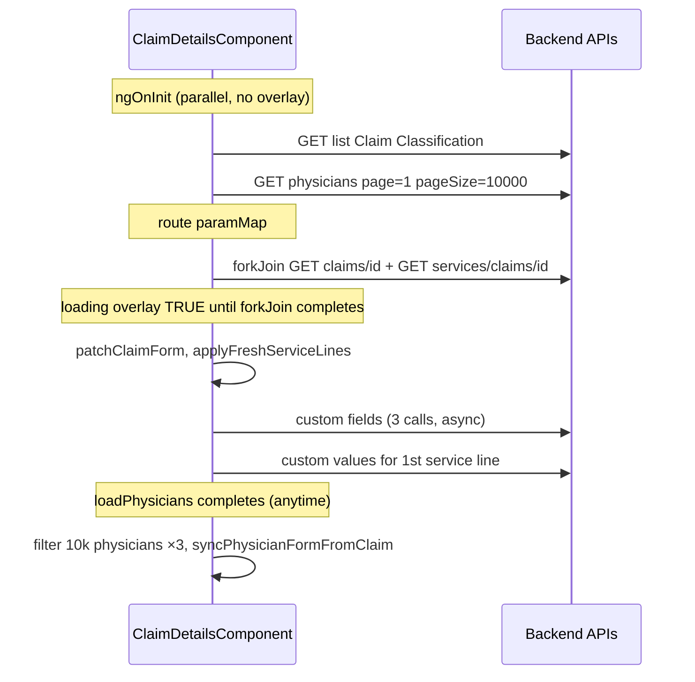

# Claim Details — performance investigation report

**Status:** Investigation + temporary dev instrumentation only (no optimizations applied).  
**Target:** Initial open/load of Claim Details (`/claims/:id`).

---

## How to capture timings

1. Run UI in **development** (`environment.production === false`).
2. Open DevTools → **Console**; filter `[ClaimDetailsPerf]`.
3. Open a claim from the list (cold open).
4. Note:
   - `console.time` durations (API blocks)
   - `+Nms` timeline marks (ordering)
   - **Network** tab (parallel requests, payload sizes, waterfall)

Remove instrumentation after fixes land (`perfLog` block in `claim-details.component.ts`).

---

## 1. Initialization flow (code trace)



| Step | When | Blocks overlay? | Blocks `*ngIf="claim"`? |
|------|------|-----------------|-------------------------|
| `loadClassificationOptions()` | `ngOnInit` | No | Yes (no claim yet) |
| `loadPhysicians(1, 10000)` | `ngOnInit` | No | Yes |
| `forkJoin(getClaimById, getServicesByClaim)` | `loadClaim` | **Yes** | **Yes** |
| `patchClaimForm` + `applyFreshServiceLines` | After forkJoin | No | Claim already set |
| `loadClaimCustomFieldsAndValues` | After forkJoin | No | No |
| `loadServiceLineCustomValuesFor` | First line selected | No | No |
| Payments/adjustments/disbursements | Tab click only | No | No |

**Perceived slowness** = time until `loading === false` **and** first full template render (large DOM).

---

## 2. Bottleneck summary (ranked)

### B1 — `GET /api/claims/{id}` heavy backend graph (Backend + Network)

| Attribute | Detail |
|-----------|--------|
| **What** | `GetClaimById` runs **6+ sequential DB round-trips**: claim header, insureds, service lines, all adjustments for those lines, all disbursements, claim audit (50 rows). |
| **Payload** | Each service line embeds `Adjustments[]` and `Disbursements[]` (with nested payment). Grows with line count and payment history. |
| **Blocking** | **High** — half of `forkJoin`; often the slower request. |
| **Frequency** | Every claim open |
| **Layer** | Backend (primary), network (secondary) |

**Evidence:** `ClaimsController.cs` ~1987–2233.

---

### B2 — Duplicate service line fetch (Frontend + Backend)

| Attribute | Detail |
|-----------|--------|
| **What** | Same open also calls `GET /api/services/claims/{claId}` (up to 200 lines) while claim response already includes service lines. |
| **Why** | `applyFreshServiceLines` merges fresh totals over embedded lines. |
| **Blocking** | **High** — `forkJoin` waits for **both**; doubles service-line DB/API work. |
| **Frequency** | Every claim open |
| **Layer** | Frontend orchestration + backend |

---

### B3 — Physicians `pageSize=10000` (Frontend + Network + Render)

| Attribute | Detail |
|-----------|--------|
| **What** | `loadPhysicians()` → `getPhysicians(1, 10000)` loads entire facility physician library. |
| **CPU** | Three `.filter()` passes over full array; `ensureCurrentPhysiciansInOptions` spreads arrays. |
| **DOM** | Three `<select>` with `*ngFor` over `billingProviders`, `renderingProviders`, `serviceFacilities` (can be hundreds–thousands of `<option>` nodes). |
| **Blocking overlay** | No |
| **Blocking paint** | **High** when claim appears — main-thread work + layout on first render |
| **Frequency** | Every visit to Claim Details component |
| **Layer** | Frontend (filter/render); network (large JSON) |

**Note:** Does not block overlay, but strongly affects “page feels frozen” right after spinner hides.

---

### B4 — Full-page render gated on `claim` (Frontend / Render)

| Attribute | Detail |
|-----------|--------|
| **What** | Template uses `*ngIf="claim as c"` — nothing below header renders until claim arrives. |
| **Then** | Large single template: diagnosis grid, physician section, **service lines table** (16 cols × N rows with inputs), notes, secondary tabs structure. |
| **Change detection** | `OnPush` but **many** `markForCheck()` after each async completion → multiple full checks. |
| **Blocking** | **Medium–High** after data arrives |
| **Layer** | Frontend render |

---

### B5 — `applyFreshServiceLines` + `normalizeServiceLine` per row (Frontend)

| Attribute | Detail |
|-----------|--------|
| **What** | Maps every line through `normalizeServiceLine` (date coercion, spread merge). |
| **Cost** | O(n) CPU; triggers `markForCheck` + optional custom-field fetch for first line. |
| **Blocking** | **Medium** on claims with many lines |
| **Layer** | Frontend |

---

### B6 — Custom fields waterfall (Frontend + Network)

| Attribute | Detail |
|-----------|--------|
| **What** | After main load: `getByEntityType('Claim')` → nested `getValues('Claim')`; parallel `getByEntityType('ServiceLine')`; on line select `getValues('ServiceLine', srvId)`. |
| **Blocking** | **Low** for overlay (async after claim shown) |
| **Impact** | Extra network + `markForCheck` churn; can lag custom-fields section |
| **Layer** | Frontend |

---

### B7 — Form patch / sync churn (Frontend)

| Attribute | Detail |
|-----------|--------|
| **What** | `patchClaimForm()` on claim load; `syncPhysicianFormFromClaim()` when physicians finish (may run **after** claim load). |
| **valueChanges** | **None** on physician FKs (billing validation removed). |
| **Risk** | Second `patchValue` when physicians complete if FK controls still empty — usually no-op after fix. |
| **Blocking** | **Low** |
| **Layer** | Frontend |

---

### B8 — `displayServiceLinesArray` getter sort (Frontend)

| Attribute | Detail |
|-----------|--------|
| **What** | Getter copies and sorts array on every change detection when sort key set. |
| **Blocking** | **Low** unless user sorted + many lines |
| **Layer** | Frontend |

---

### NOT bottlenecks on initial load

| Item | Why |
|------|-----|
| Payments / adjustments / disbursements APIs | Lazy-loaded on tab change only |
| Claim save validation | Not on load |
| Payer library on claim details | Not loaded here |
| Service-line totals getters | Simple reduces; not recalculated on load beyond normalize |

---

## 3. Network tab checklist

On one slow claim, record:

| Request | Expected role | Red flag |
|---------|---------------|----------|
| `GET /api/lists/values?...Claim Classification` | Dropdown | Slow > 300ms |
| `GET /api/physicians?page=1&pageSize=10000` | Physician dropdowns | **Large response** (>500KB?) |
| `GET /api/claims/{id}` | Main claim | **Largest/slowest** |
| `GET /api/services/claims/{id}` | Line totals | **Duplicate** of embedded lines |
| `GET /api/custom-fields/...` (×2–3) | Custom fields | Waterfall after paint |

**Waterfall:** `forkJoin` starts after paramMap; physicians/classification start earlier but may finish later.

---

## 4. Reactive-form / sync findings

| Pattern | Present? | Impact |
|---------|----------|--------|
| `patchClaimForm` on load | Yes | 1× per claim |
| `syncPhysicianFormFromClaim` after physicians | Yes | 0–1× extra patch |
| `valueChanges` subscriptions | No (removed billing) | — |
| Loops patching per line | No | — |

---

## 5. Recommended minimal optimizations (after timing confirms)

**Do not implement blindly** — confirm with `[ClaimDetailsPerf]` + Network on a slow claim.

| Priority | Change | Expected gain |
|----------|--------|----------------|
| P0 | **Backend:** Slim `GetClaimById` for details screen (header + insureds + activity; **no** per-line adjustments/disbursements) OR dedicated lightweight DTO | Large reduction in B1 payload/time |
| P0 | **Frontend:** Stop duplicate fetch — use **only** `getServicesByClaim` for grid totals, **or** only embedded lines until user refreshes | Removes B2 |
| P1 | **Physicians:** Load filtered subsets (`isPerson`, `isFacility`, billing classification) with reasonable pageSize, or load-by-PhyID for claim’s three FKs + search | Cuts B3 network + DOM |
| P1 | **Defer** `loadPhysicians` until after claim visible, or after forkJoin | Improves time-to-interactive |
| P2 | **Defer** custom field definitions until “Custom fields” section expanded | Cuts B6 |
| P2 | Memoize `displayServiceLinesArray` (property refreshed only when lines/sort change) | Cuts B8 |
| P3 | **Virtualize** physician dropdowns or typeahead (larger UX change) | If B3 remains after P1 |

---

## 6. Instrumentation locations

`claim-details.component.ts`:

- `perfReset` / `perfMark` / `perfTime` / `perfTimeEnd`
- `loadClaim` forkJoin (overlay blocker)
- `loadPhysicians`, `loadClassificationOptions`
- `patchClaimForm`, `syncPhysicianFormFromClaim`, `applyFreshServiceLines`
- `loadClaimCustomFieldsAndValues`
- `schedulePerfRenderComplete` (rAF × 2 after service lines)

---

## 7. Example console output (interpretation)

```text
[ClaimDetailsPerf] ── session: loadClaim claId=12345 ──
[ClaimDetailsPerf] +0ms loadClaim start (forkJoin: claim + services)
[ClaimDetailsPerf] loadClaim forkJoin (blocks overlay): 2847ms
[ClaimDetailsPerf] +2850ms loadClaim overlay dismissed
[ClaimDetailsPerf] applyFreshServiceLines: 12ms
[ClaimDetailsPerf] +2900ms render complete (after service lines) { serviceLineCount: 24, physicianCount: 8421, ... }
[ClaimDetailsPerf] loadPhysicians (API pageSize=10000): 4102ms   ← may finish AFTER paint
```

If **overlay** time ≈ `forkJoin` and **physicians** finishes later, spinner is B1+B2; slowness after spinner is B3+B4.

---

*Investigation only. Temporary logs active in non-production builds.*
