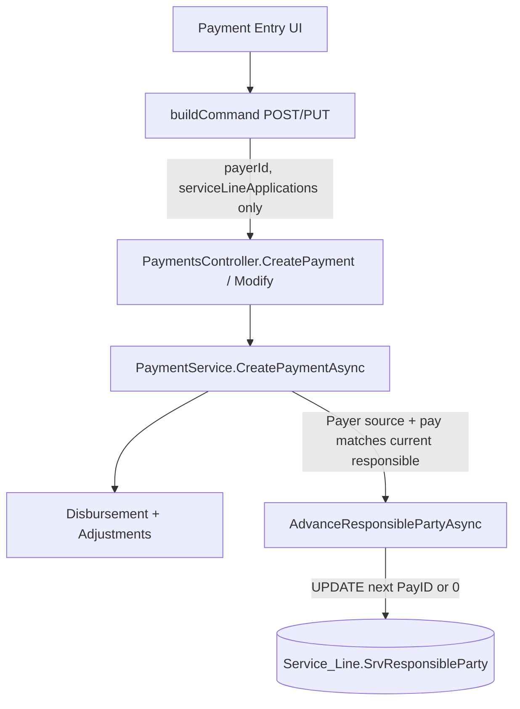

# Payment Entry — `FK_ServiceLine_ResponsibleParty` investigation

**Status:** Investigation only (no DB constraint changes, no FK fix yet).  
**Error:** `The UPDATE statement conflicted with the FOREIGN KEY constraint "FK_ServiceLine_ResponsibleParty"` referencing `dbo.Payer.PayID`.

---

## Executive summary

Payment Entry **does not** send `ResponsibleParty` / `SrvResponsibleParty` in the save payload. The FK failure happens on the **backend** when `PaymentService` applies a **Payer** payment and calls `AdvanceResponsiblePartyAsync`, which **UPDATE**s `Service_Line.SrvResponsibleParty` to a value that is **not** a valid `Payer.PayID`.

Most likely invalid values (ranked):

| Rank | Value written | Why |
|------|----------------|-----|
| 1 | **`0`** | Advance logic uses `0` = patient responsibility in app code, but column has **required FK** to `Payer` — `0` is not a valid `PayID` unless a legacy `PayID=0` row exists. |
| 2 | **Stale `Claim_Insureds.ClaInsPayFID`** | Secondary (or primary) payer ID on claim insured points to deleted/wrong-tenant payer. |
| 3 | **Invalid primary from claim sync** | `UpdateServiceLineResponsibleParty` (claim save path) sets all lines to `payloadPayerId` without existence check — separate from payment entry but same FK. |

**Not the cause for Payment Entry save:** UI sending payer name, `"Patient"`, `"SelfPay"`, or responsible party in JSON body (none are sent).

---

## 1. End-to-end pipeline (`/payments/entry`)



### Frontend (`payment-entry.component.ts`)

| Step | Behavior |
|------|----------|
| Payer dropdown | `formControlName="payerId"` → `[ngValue]="p.payID"` from `payerApi.getPayers()` (active payers only). |
| Grid “Responsible” column | **Display only** — `row.responsible` string from API (`"Patient"` or payer name). Not editable. |
| `buildCommand()` | Sends `paymentSource`, `payerId`, `claimId`, `patientId`, `amount`, `serviceLineApplications[]` with `serviceLineId`, `paymentAmount`, `adjustments`. **No `responsibleParty` field.** |
| `ignoreResponsibleParty` checkbox | Stored in **localStorage only** — **not** sent to API (load filter unchanged on server). |

### API (`POST /api/payments`, `PUT /api/payments/{id}`)

- Body: `CreatePaymentCommand` (`Zebl.Application/Dtos/Payments/CreatePaymentCommand.cs`).
- `Modify` = delete old payment + `CreatePaymentAsync` (same path).

### Backend apply (`PaymentService.CreatePaymentAsync`)

For each `ServiceLineApplication`:

1. Load line totals; `currentResponsiblePayerId = GetPayerIdForLineAsync` → `SrvResponsibleParty`.
2. Create disbursement / adjustments.
3. **Only if** `PaymentSource == Payer`, `payerId > 0`, `currentResponsiblePayerId == payerId`, and amount/adjustments applied:

```csharp
await _serviceLineRepo.AdvanceResponsiblePartyAsync(app.ServiceLineId);
```

Patient-source payments **do not** call advance (no `SrvResponsibleParty` write on that path).

### Advance logic (`ServiceLineRepository.AdvanceResponsiblePartyAsync`)

Reads claim insured sequence 1/2 → `primaryPayerId`, `secondaryPayerId` from `Claim_Insureds.ClaInsPayFID`.

| Current `SrvResponsibleParty` | `next` assigned |
|------------------------------|-----------------|
| `== primaryPayerId` | `secondaryPayerId` if `> 0`, else **`0`** |
| `== secondaryPayerId` | **`0`** |
| Otherwise | unchanged (no save) |

Then `SaveChangesAsync()` → **FK enforced** on `next`.

---

## 2. Actual value written to `Service_Line.ResponsibleParty`

Column: **`SrvResponsibleParty`** (`int`, non-nullable, FK → `Payer.PayID`).

| Source | When |
|--------|------|
| Payment save | `AdvanceResponsiblePartyAsync` sets `next` (see table above). |
| Claim save (related) | `UpdateServiceLineResponsibleParty(claimId, newPayerId)` raw SQL when bill-to / primary payer changes. |
| Service line CRUD (related) | `ServicesController` PUT with `srvResponsibleParty` from Claim Details (sends `null` for patient intent, keeps existing FK). |
| HL7 import | Must be positive payer ID (explicit guard). |

**Payment Entry:** the failing UPDATE is almost certainly **`AdvanceResponsiblePartyAsync`** during payer payment apply, not the HTTP payload.

---

## 3. UI / payload checks (task 3)

| Hypothesis | Payment Entry? |
|------------|----------------|
| Payer name instead of ID | No — dropdown uses `payID`. |
| `"Patient"` / `"SelfPay"` in FK column | No — not in save body; display string only. |
| `0` / `-1` in payload | No responsible field in payload. |
| `null` fallback | N/A for responsible on payment POST. |
| Deleted payer ID in **dropdown** | Unlikely — list is live payers; payment `payerId` should exist. |
| Stale value in **advance target** | **Yes** — `ClaInsPayFID` on claim insured or **`0`** as patient sentinel. |

---

## 4. DB constraint semantics

```text
Service_Line.SrvResponsibleParty → Payer.PayID (FK_ServiceLine_ResponsibleParty)
```

| Application semantics | Code reference |
|----------------------|----------------|
| `SrvResponsibleParty == 0` | Treated as **Patient** (`ServiceLineRepository` payment grid: `"Patient"`; balance split uses pat vs ins balance). |
| `SrvResponsibleParty > 0` | Insurance responsible; must be valid payer. |

**Design mismatch:** Business logic uses **`0` = patient** without a payer row, but EF maps a **required** FK to `Payer`. Any `UPDATE` to `0` (or missing `PayID`) violates the constraint unless the database has a matching payer row (e.g. legacy `PayID = 0` patient placeholder).

**Self-pay:** Not stored as a string; would be patient balance (`0`) or a specific payer ID if modeled as payer — must not write non-`PayID` values.

---

## 5. Investigation logs added (temporary)

**Frontend** — on Save / Save & Close:

```text
[PaymentEntry] save command (ResponsibleParty not in payload; backend may advance SrvResponsibleParty)
  → payerId, serviceLineApplications, gridResponsible labels
```

**Backend** — `PaymentService` before advance; `ServiceLineRepository` immediately before UPDATE:

```text
Payment save advancing ResponsibleParty. ServiceLineId=… PaymentPayerId=… CurrentSrvResponsibleParty=…
Saving ServiceLine ResponsibleParty={next} SrvID=… (was {current}). PrimaryPayer=… SecondaryPayer=…
```

Restart API after deploy to capture logs on repro.

---

## 6. Root-cause classification

| Layer | Verdict |
|-------|---------|
| Frontend dropdown binding | **Unlikely** for FK on payment save (payerId valid; no responsible in payload). |
| Stale/deleted payer | **Likely** for **secondary** `ClaInsPayFID` used as `next`. |
| Invalid mapping (0 = patient) | **Very likely** when advancing primary → patient (`next = 0`). |
| DB design mismatch | **Yes** — sentinel `0` vs required FK. |
| Legacy sentinel | Confirm whether `SELECT PayID FROM Payer WHERE PayID = 0` exists in target DB. |

**Primary root cause (code):** `AdvanceResponsiblePartyAsync` assigns **`SrvResponsibleParty = 0`** (or an unvalidated insured payer ID) while SQL Server requires every value to exist in **`Payer.PayID`**.

---

## 7. Dropdown vs real PayID (task 7)

Payment Entry payer dropdown: `payerList` from `GET` payers API → options are real `PayID`s.

Grid “Responsible” is **not** a dropdown — read-only label from server (`responsible` on `PaymentEntryServiceLineDto`).

Claim Details service lines (separate screen) use payer IDs for responsible party dropdown; Payment Entry does not edit responsible party.

---

## 8. Patient / self-pay (task 8)

- Patient payments: `paymentSource: 0`, `payerId: null` — **no** `AdvanceResponsiblePartyAsync`.
- Patient responsibility in data model: **`SrvResponsibleParty = 0`** in reads/recalc — must not be persisted via advance unless `PayID=0` exists.
- Application should **not** store `"Patient"` / self-pay strings in `SrvResponsibleParty` — confirmed for payment entry path.

---

## 9. SQL to confirm on failing claim

Replace `@ClaimId`, `@SrvId`, `@TenantId`, `@FacilityId`:

```sql
-- Lines and current responsible
SELECT s.SrvID, s.SrvResponsibleParty, s.SrvClaFID
FROM Service_Line s
WHERE s.SrvClaFID = @ClaimId;

-- Claim insured payer FKs (advance inputs)
SELECT ClaInsSequence, ClaInsPayFID
FROM Claim_Insured
WHERE ClaInsClaFID = @ClaimId AND ClaInsSequence IN (1, 2);

-- Do advance targets exist?
SELECT p.PayID, p.PayName, p.TenantId, p.FacilityId
FROM Payer p
WHERE p.PayID IN (
  SELECT ClaInsPayFID FROM Claim_Insured WHERE ClaInsClaFID = @ClaimId
  UNION SELECT SrvResponsibleParty FROM Service_Line WHERE SrvClaFID = @ClaimId
);

-- Patient placeholder row?
SELECT * FROM Payer WHERE PayID = 0;
```

On repro, API logs should show exact `next` value that failed (e.g. `ResponsibleParty=0` or orphaned secondary ID).

---

## 10. Recommended fix direction (not implemented)

1. Before `SaveChanges` in advance: ensure `next == 0` only if DB supports it, else map to a **Patient** placeholder `PayID` or make FK optional/nullable (schema decision).
2. Validate `primaryPayerId` / `secondaryPayerId` exist in `Payer` for tenant/facility before assign.
3. Skip advance (or log warning) when secondary ID invalid.
4. Align `UpdateServiceLineResponsibleParty` with same validation.

---

## Key files

| Area | Path |
|------|------|
| Payment Entry UI | `src/app/payments/payment-entry/payment-entry.component.ts` |
| Payment API client | `src/app/core/services/payment-api.service.ts` |
| Payment apply | `Zebl.Application/Services/PaymentService.cs` |
| Advance / UPDATE | `Zebl.Infrastructure/Repositories/ServiceLineRepository.cs` |
| Payments API | `Zebl.Api/Controllers/PaymentsController.cs` |
| FK config | `Zebl.Infrastructure/Persistence/Context/ZeblDbContext.cs` (~1635) |
| Entity | `Zebl.Infrastructure/Persistence/Entities/Service_Line.cs` |

---

*Investigation report only. Temporary logs added for runtime confirmation; no FK or advance-logic fix applied.*
